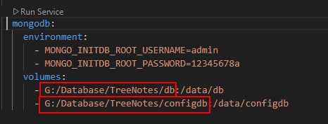

# Introduction 

This project is a web application where users can create notes in a hierarchical way (tree). It is a small project I did some years ago to learn and teach Clean Architecture and related technologies as a practical example. It is not a finished project. 
The project uses MongoDB to store the user notes and Redis Cache as the external cache.

This project is good for learning the following technologies:

- Clean Architecture
- Domain-Driven Design (DDD)
- API First
- JWT Authentication Tokens
- MediatR/CQRS
- MongoDB
- Redis Cache
- Unit Tests with xUnit
- ReactJS

# Build and Test
The easiest way to run this app is by using the Docker Compose files in the project's root directory.

First, you must configure a directory for the MongoDB database on your host. This way, your data will reside on your system and not in the container, avoiding the loss of your data in case the container is destroyed.

Configure the folders below to a folder on your system.

Use the command **"docker compose up --build"** to build and run all project services and dependencies, like MongoDB, Redis, and Seq.

Once running, open your browser and type http://localhost:5200/login