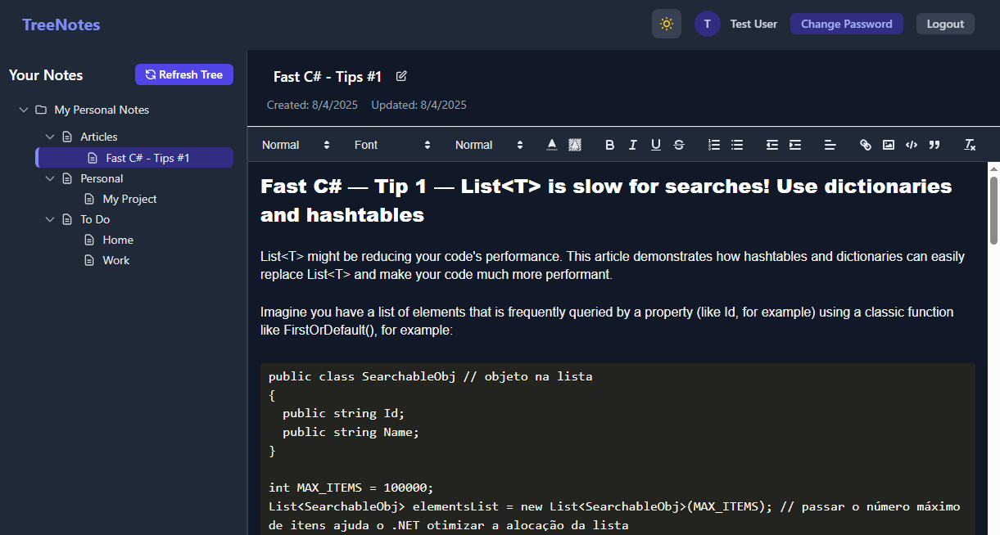

# Introduction 

This project is a web application where users can create notes in a hierarchical way (tree). It is a small project I did some years ago to learn and teach Clean Architecture and related technologies as a practical project. It is not a finished project. 
The project uses MongoDB to store the user notes and RedisCache as the external cache.

A running sample can be seen at this link: https://notes.botelho.cc/. (Note: This is for demonstration purposes, and all changes made to this repository are reset every hour.)

This project is good for learning the following technologies:

- Clean Architecture
- Domain Driven-Driven Design (DDD)
- API First
- JWT Authentication tokens
- MediaTRMediatR/CQRS
- Mongo DBMongoDB
- Redis Cache
- Unit tests with xUnit
- ReactJS

# Build and Test
The easiest way to execute this app is by using the Docker Compose files in the project's root directory. Just use the command **"docker compose up"** to build and run all project services and dependencies, like MongoDB, Redis, and Seq.

Once running, open your browser and type http://localhost:5200/login.

